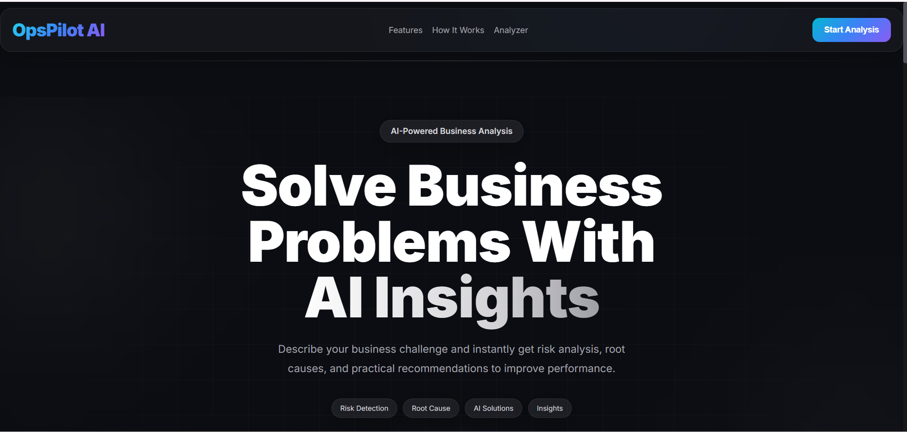
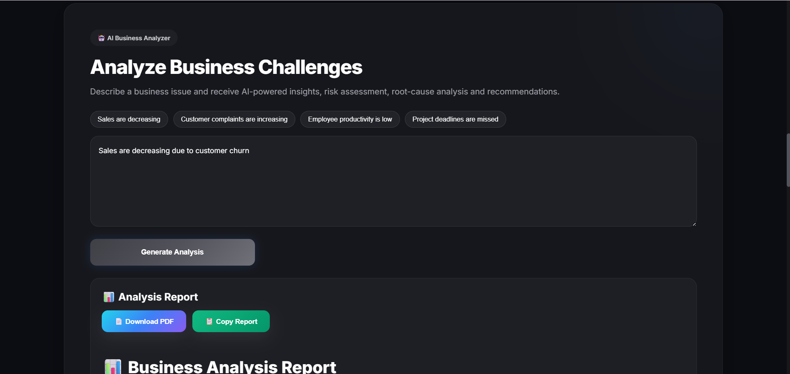
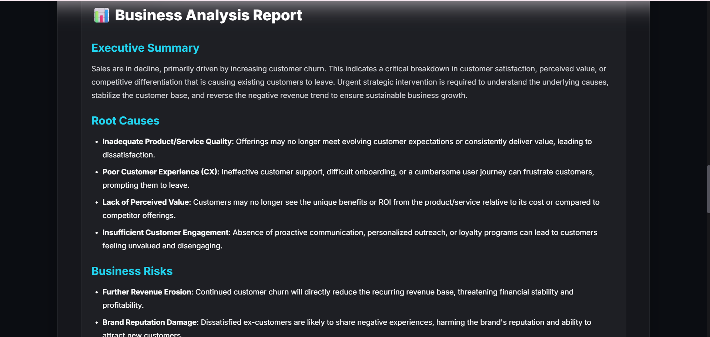
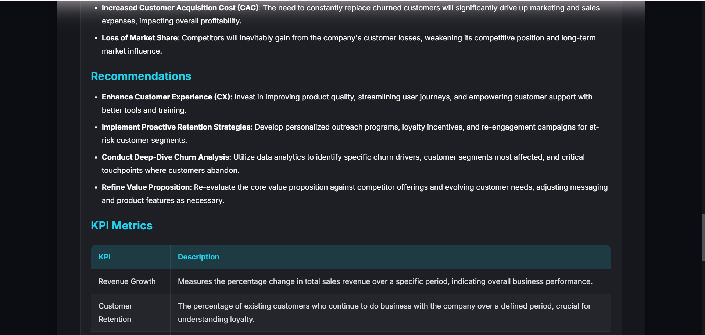
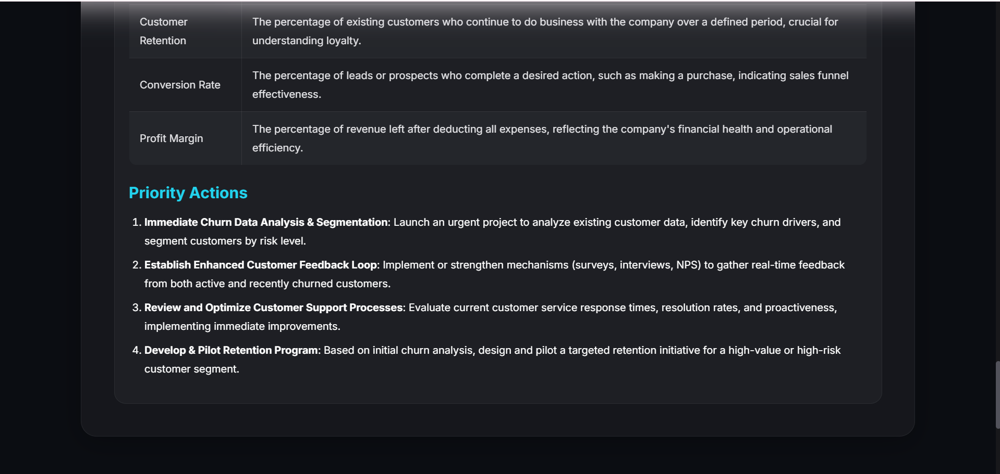
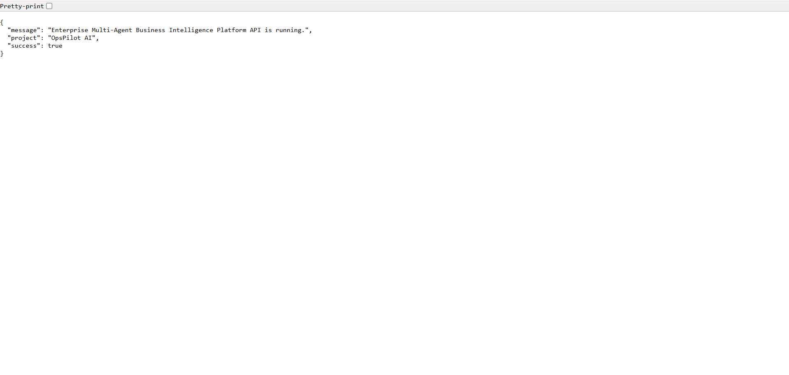
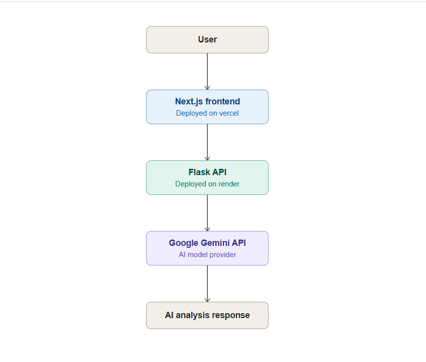
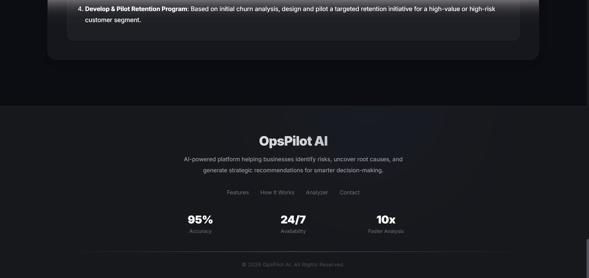

# OpsPilot AI 🚀

## Enterprise Multi-Agent Business Intelligence Platform

OpsPilot AI is an AI-powered multi-agent platform that helps businesses analyze operational challenges, identify root causes, assess risks, and generate actionable recommendations using Google's Gemini AI.

---

## Problem Statement

Businesses often struggle to quickly analyze operational issues such as declining sales, customer complaints, low productivity, and project delays. Manual analysis is time-consuming and inconsistent.

---

## Solution

OpsPilot AI uses multiple AI agents to automatically analyze business problems, identify root causes, estimate risks, and provide strategic recommendations.

---

## Architecture

User
↓
Next.js Frontend (Vercel)
↓ REST API
Flask Backend (Render)
↓
Google Gemini AI
↓
Business Analysis Response

---

## Features

- AI-powered business analysis
- Multi-agent architecture
- Risk assessment
- Root cause analysis
- Business recommendations
- Modern responsive UI
- Cloud deployment

## Security Features

- Input validation
- Prompt injection protection
- Request size limitation
- Environment variable based API key management
- CORS enabled

---

## Tech Stack

### Frontend

- Next.js
- React
- TypeScript
- Framer Motion

### Backend

- Python
- Flask
- Flask-CORS

### AI

- Google Gemini API

### Deployment

- Vercel (Frontend)
- Render (Backend)

---

## Setup

### Clone Repository

```bash
git clone https://github.com/dhanashrimahale900-code/OpsPilot.git


# 📸 Screenshots

## 🏠 Home Page


## 🤖 AI Features


## 📊 Business Analysis


## 🧠 AI Analysis Result 1


## 📈 AI Analysis Result 2


## 📋 AI Analysis Result 3


## ⚙️ Backend API


## 🏗️ System Architecture


## 🔄 How OpsPilot Works


## 📄 Footer



## 🌐 Live Demo

Frontend: 
https://business-ai-opspilot.vercel.app

Backend:  
https://opspilot-ftc0.onrender.com

GitHub Repository:  
https://github.com/dhanashrimahale900-code/OpsPilot

## 🎯 Kaggle Capstone Requirements

This project demonstrates the following concepts from the AI Agents Intensive Vibe Coding course:

- ✅ AI Agent-based business analysis workflow
- ✅ Secure API key management using environment variables
- ✅ Cloud deployment using Vercel and Render
- ✅ REST API communication between frontend and backend
- ✅ Google Gemini AI integration for intelligent reasoning
